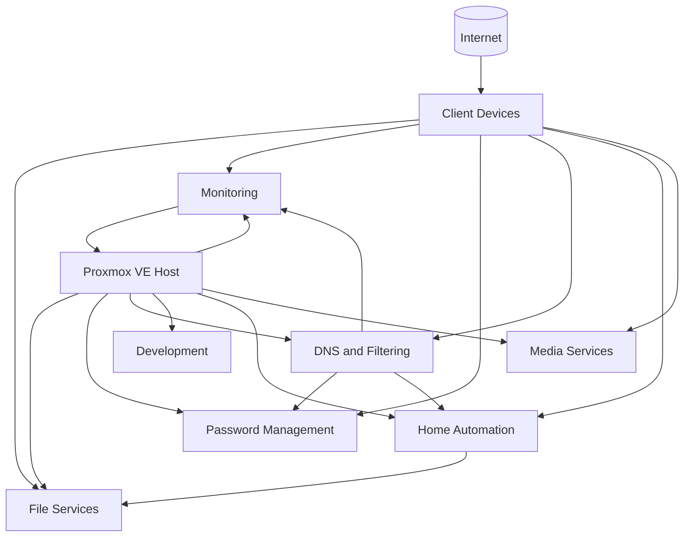

# Homelab Infrastructure

Sanitized documentation, automation, configuration examples, and operational records from my personal homelab environment.

This repository is a public portfolio of systems administration, infrastructure engineering, automation, observability, service operations, documentation, and systems design work. It deliberately excludes live credentials, exact location data, private endpoints, secrets, and other sensitive operational details.

## Start here

If you are reviewing this repository as a portfolio, these are the best entry points:

1. **Architecture:** [`architecture/overview.md`](architecture/overview.md) provides the sanitized system topology, workload roles, backup model, and design principles.
2. **Systems operations:** [`proxmox/README.md`](proxmox/README.md) explains the maintenance model and links to workload-specific runbooks.
3. **Networking:** [`networking/README.md`](networking/README.md) documents DNS, split DNS, reverse-proxy patterns, dependencies, and troubleshooting.
4. **Monitoring:** [`monitoring/README.md`](monitoring/README.md) explains the Prometheus, Grafana, exporter, and alerting model.
5. **Backup and recovery:** [`backup-recovery/README.md`](backup-recovery/README.md) documents the layered recovery model across snapshots, application backups, logical database dumps, and network backup copies.
6. **Security:** [`security/README.md`](security/README.md) describes exposure reduction, service accounts, secrets handling, backup resilience, and hardening priorities.
7. **Automation case study:** [`home-assistant/hvac/README.md`](home-assistant/hvac/README.md) documents a presence-aware HVAC control system built in Home Assistant.
8. **Change management:** [`change-management/README.md`](change-management/README.md) describes the lightweight change-control framework used throughout the lab.
9. **Detailed change examples:** [`change-management/examples/`](change-management/examples/) contains deeper records showing problem analysis, implementation, validation, rollback, and lessons learned.
10. **History:** [`changelog/README.md`](changelog/README.md) shows how the environment has evolved over time.
11. **Planned work:** [`ROADMAP.md`](ROADMAP.md) tracks future infrastructure and security improvements.

## What this repository demonstrates

* Proxmox VE administration across virtual machines and Linux containers
* Linux server and service maintenance
* Docker Compose application operations
* Prometheus and Grafana observability
* PostgreSQL backup and validation
* Home Assistant automation and appliance maintenance
* Samba-based network storage and dedicated service accounts
* DNS, split DNS, reverse-proxy, and TLS architecture
* Service dependency mapping and layered network troubleshooting
* Workload-specific backup and rollback design
* Security hardening and exposure reduction patterns
* Change management and maintenance documentation
* Validation of application health beyond package-manager success
* Public technical documentation with deliberate security sanitization

## Homelab architecture

The environment is centered on a Proxmox VE host that provides virtualization for the major infrastructure and application domains in the lab.



High-level view of the major functional domains hosted on the Proxmox platform.

For a more detailed operational view, see [`architecture/overview.md`](architecture/overview.md).

## Featured case studies

### Presence-aware residential HVAC control

A Home Assistant based HVAC control system that combines deterministic weekly scheduling with presence-aware daytime temperature control, neighborhood geofencing, delayed absence detection, and manual override capability.

```text
Phone location
    |
    v
Home Assistant person entity
    |
    v
Neighborhood zone logic
    |
    +--> resident nearby --> comfort target
    |
    +--> away > 30 min --> away target
                          |
Weekly scheduler ----------+
                          v
                 Versatile Thermostat
                          |
                          v
                      Alarm.com
                          |
                          v
                Physical thermostat
```

The implementation separates predictable schedule transitions from dynamic presence corrections. It also applies a continuous absence threshold so short errands and neighborhood activity do not unnecessarily change the HVAC setpoint.

See [`home-assistant/hvac/`](home-assistant/hvac/) for the design notes, schedule model, and sanitized automation.

### Proxmox guest maintenance and service validation

Maintenance workflows treat the hypervisor and each guest as separate operational domains. The live guest inventory is reconciled before maintenance, rollback protection is selected based on workload risk, and application health is validated independently of operating-system package state.

Examples include:

* Docker-based Prometheus, Grafana, and NUT exporter maintenance
* QEMU Guest Agent deployment and validation
* PostgreSQL logical backup before VM maintenance
* Home Assistant local and external backup validation
* LVM thin-pool utilization checks before snapshot-heavy changes
* Vaultwarden application image refresh in addition to guest OS maintenance
* Pi-hole DNS validation after package maintenance
* Samba configuration and service validation

See [`proxmox/`](proxmox/) for the operational model and runbooks.

### Networking and dependency isolation

The networking section documents the relationship between local DNS, reverse proxy, TLS, backend applications, and dependent services.

The troubleshooting model works from the outside inward so symptoms such as "the site is down" can be isolated to DNS, connectivity, certificate, proxy, application, or dependency failures before changes are made.

See:

* [`networking/README.md`](networking/README.md)
* [`networking/service-dependencies.md`](networking/service-dependencies.md)
* [`networking/network-troubleshooting-runbook.md`](networking/network-troubleshooting-runbook.md)

### Monitoring and observability

Prometheus, Grafana, Node Exporter, the PVE exporter, and the NUT exporter provide the current monitoring foundation. Alertmanager is the selected next step for notification routing and alert delivery.

See [`monitoring/README.md`](monitoring/README.md) and [`monitoring/alerting-roadmap.md`](monitoring/alerting-roadmap.md).

### Backup and recovery

The backup model uses multiple recovery layers so each failure can be addressed at the narrowest practical scope.

Examples include:

* short-lived Proxmox snapshots for fast VM rollback
* Home Assistant local and external network backups
* PostgreSQL logical dumps for database-level recovery
* Docker persistent storage for stateful application data
* dedicated Samba storage for backup copies outside protected workloads

See [`backup-recovery/README.md`](backup-recovery/README.md) for the architecture and recovery decision model.

### Change management in practice

The lab uses a lightweight change-management model designed to preserve technical intent without introducing unnecessary administrative overhead.

Detailed examples include:

* [`Split DNS and Vaultwarden HTTPS`](change-management/examples/split-dns-vaultwarden-https.md)
* [`Home Assistant rebuild`](change-management/examples/home-assistant-rebuild.md)
* [`Monitoring VM maintenance`](change-management/examples/monitoring-vm-maintenance.md)

These examples document the problem, scope, risk, implementation, validation evidence, rollback path, and lessons learned.

## Repository map

```text
architecture/
  overview.md

backup-recovery/
  README.md
  diagrams/
    backup-recovery-architecture.png

change-management/
  README.md
  examples/
    home-assistant-rebuild.md
    monitoring-vm-maintenance.md
    split-dns-vaultwarden-https.md
  templates/
    change-record.md
    maintenance-record.md

changelog/
  README.md
  2026/
    README.md
    2026-08.md
    2026-06.md
    2026-05.md
    2026-02.md

home-assistant/
  hvac/
    README.md
    presence-based-hvac.yaml
    weekly-schedule-design.md

monitoring/
  README.md
  alerting-roadmap.md
  diagrams/
    monitoring-diagram.png

networking/
  README.md
  dns-and-split-dns.md
  network-troubleshooting-runbook.md
  reverse-proxy-pattern.md
  service-dependencies.md

proxmox/
  README.md
  runbooks/
    development-vm-maintenance.md
    fileshare-container-maintenance.md
    home-assistant-vm-maintenance.md
    monitoring-vm-maintenance.md
    pihole-container-maintenance.md
    vaultwarden-container-maintenance.md

security/
  README.md

ROADMAP.md
SECURITY.md
.gitignore
```

## Operating philosophy

A few principles recur throughout this environment:

1. Reconcile the live inventory before maintenance.
2. Validate the hosted application, not only the operating system.
3. Use workload-appropriate recovery controls such as snapshots, application backups, and database dumps.
4. Separate predictable schedules from dynamic automation logic.
5. Use dedicated service accounts for machine-to-machine access when practical.
6. Remove temporary rollback artifacts after successful validation.
7. Treat application updates and guest operating-system updates as separate maintenance layers when appropriate.
8. Troubleshoot dependencies before restarting services or changing configuration.
9. Reduce exposure and trust boundaries wherever practical.
10. Keep public documentation useful to reviewers without exposing the live environment unnecessarily.

## Current technology areas

| Area | Technologies and concepts |
|---|---|
| Virtualization | Proxmox VE, KVM, LXC, snapshots, QEMU Guest Agent |
| Linux operations | Ubuntu, Debian-based package management, systemd, SSH |
| Containers | Docker, Docker Compose, persistent volumes |
| Observability | Prometheus, Grafana, Node Exporter, PVE exporter, NUT exporter, Alertmanager roadmap |
| Data | PostgreSQL, logical backups, query validation |
| Network services | Pi-hole, split DNS, Samba, reverse proxy, TLS |
| Backup and recovery | Proxmox snapshots, Home Assistant backups, Samba backup copies, PostgreSQL dumps |
| Security | Service accounts, exposure reduction, trusted proxies, secrets handling, recovery controls |
| Identity and secrets | Vaultwarden, dedicated service identities |
| Home automation | Home Assistant OS, HACS, Zigbee, climate automation |
| Operations | Change records, maintenance runbooks, rollback planning, validation |

## Roadmap

The lab remains an active engineering environment. Planned work includes secure remote access, dedicated reverse-proxy isolation, certificate-expiration monitoring, automated backup restore testing, SSH hardening, enhanced UPS notifications, and additional observability.

See [`ROADMAP.md`](ROADMAP.md) for the current backlog.

## Security and sanitization

The public repository is a curated documentation source, not a mirror of the live homelab configuration. Configuration examples are reviewed and sanitized before publication.

See [`security/README.md`](security/README.md) for the homelab security model and [`SECURITY.md`](SECURITY.md) for publication rules.
