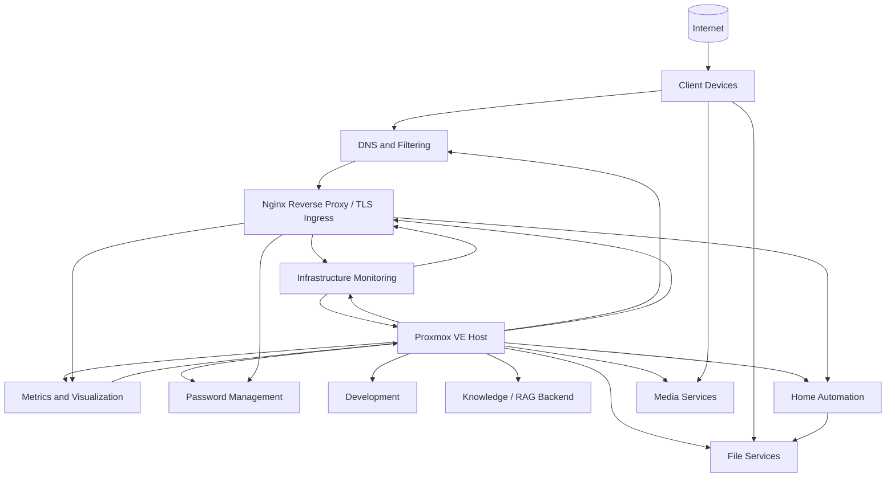

# Homelab Infrastructure

Sanitized documentation, automation, configuration examples, and operational records from my personal homelab environment.

This repository is a public portfolio of systems administration, infrastructure engineering, automation, observability, service operations, documentation, and systems design work. It deliberately excludes live credentials, exact location data, private endpoints, secrets, and other sensitive operational details.

## Start here

The following sections provide the main entry points into the homelab environment and its supporting documentation:

1. **Architecture:** [`architecture/overview.md`](architecture/overview.md) provides the sanitized system topology, workload roles, backup model, and design principles.
2. **Systems operations:** [`proxmox/README.md`](proxmox/README.md) explains the maintenance model and links to the hypervisor, guest, and full-environment maintenance procedures.
3. **Networking:** [`networking/README.md`](networking/README.md) documents DNS, split DNS, the dedicated Nginx reverse proxy, wildcard TLS, dependencies, and troubleshooting.
4. **Monitoring:** [`monitoring/README.md`](monitoring/README.md) explains the Checkmk, Prometheus, Grafana, exporter, and alert-ownership model.
5. **Backup and recovery:** [`backup-recovery/README.md`](backup-recovery/README.md) documents the layered recovery model across snapshots, application backups, logical database dumps, and network backup copies.
6. **Security:** [`security/README.md`](security/README.md) describes exposure reduction, service accounts, secrets handling, backup resilience, and hardening priorities.
7. **Automation case study:** [`home-assistant/hvac/README.md`](home-assistant/hvac/README.md) documents a presence-aware HVAC control system built in Home Assistant.
8. **Change management:** [`change-management/README.md`](change-management/README.md) describes the lightweight change-control framework used throughout the lab.
9. **Detailed change examples:** [`change-management/examples/`](change-management/examples/) contains deeper records showing problem analysis, implementation, validation, rollback, and lessons learned.
10. **Wiki:** [Homelab Infrastructure Wiki](https://github.com/myles-portfolio/homelab-infrastructure/wiki) contains the canonical sanitized change log, roadmap, and operational notes.

## What this repository demonstrates

* Proxmox VE administration across virtual machines and Linux containers
* Hypervisor, guest, and full-environment maintenance orchestration
* Linux server and service maintenance
* Docker Compose application operations
* Checkmk infrastructure and service-state monitoring
* Prometheus metrics collection and Grafana visualization
* Notification delivery through Postfix and an authenticated SMTP relay
* Planned-maintenance alert suppression through Checkmk scheduled downtime
* PostgreSQL backup and validation
* Home Assistant automation and appliance maintenance
* Samba-based network storage and dedicated service accounts
* DNS, split DNS, centralized Nginx reverse proxy, and wildcard TLS architecture
* ACME DNS challenge validation without inbound HTTP exposure
* Service dependency mapping and layered network troubleshooting
* Workload-specific backup and rollback design
* SSH key-based administration and staged access hardening
* Security hardening and exposure reduction patterns
* Change management and maintenance documentation
* Validation of application health beyond package-manager success
* Public technical documentation with deliberate security sanitization

## Homelab architecture

The environment is centered on a Proxmox VE host that provides virtualization for the major infrastructure and application domains in the lab.



High-level view of the major functional domains hosted on the Proxmox platform.

For a more detailed operational view, see [`architecture/overview.md`](architecture/overview.md).

## Featured case studies

### Dedicated reverse proxy and wildcard TLS

A dedicated unprivileged Debian container now hosts Nginx as the centralized ingress and TLS termination layer for selected internal web services.

The implementation uses a wildcard certificate issued through ACME DNS challenge validation. The private key is kept on the proxy rather than copied to every backend service, while DNS provider credentials remain outside source control.

The first production migration moved the infrastructure monitoring web interface behind the proxy. The cutover was tested before DNS changes by forcing a client request to the new ingress address while preserving the production hostname. After DNS migration, stale resolver data was traced to a host-level record, removed, and validated through direct DNS testing and the Checkmk active check.

The proxy itself uses non-root administration, Ed25519 key-based SSH, disabled password authentication after independent session validation, minimal listeners, and TLS-registered Checkmk monitoring.

See [`networking/reverse-proxy-pattern.md`](networking/reverse-proxy-pattern.md) and [`change-management/examples/dedicated-nginx-reverse-proxy.md`](change-management/examples/dedicated-nginx-reverse-proxy.md).

### Presence-aware residential HVAC control

A Home Assistant based HVAC control system that combines deterministic weekly scheduling with presence-aware daytime temperature control, neighborhood geofencing, delayed absence detection, and manual override capability.

```text
Phone location
    |
    v
Home Assistant person entity
    |
    v
Neighborhood zone logic
    |
    +--> resident nearby --> comfort target
    |
    +--> away > 30 min --> away target
                          |
Weekly scheduler ----------+
                          v
                 Versatile Thermostat
                          |
                          v
                      Alarm.com
                          |
                          v
                Physical thermostat
```

The implementation separates predictable schedule transitions from dynamic presence corrections. It also applies a continuous absence threshold so short errands and neighborhood activity do not unnecessarily change the HVAC setpoint.

See [`home-assistant/hvac/`](home-assistant/hvac/) for the design notes, schedule model, and sanitized automation.

### Proxmox maintenance and service validation

Maintenance workflows treat the hypervisor and each guest as separate operational domains while also providing a coordinated full-environment playbook. The live guest inventory is reconciled before maintenance, Checkmk downtime is scheduled before intentional disruption, rollback protection is selected based on workload risk, and application health is validated independently of operating-system package state.

Examples include:

* Proxmox repository, DNS, storage, kernel, and post-reboot validation
* VM autostart verification after hypervisor maintenance
* UEFI certificate maintenance for affected guests
* Docker-based Prometheus, Grafana, and NUT exporter maintenance
* Checkmk server, notification-path, and monitoring-recovery validation
* QEMU Guest Agent deployment and validation
* PostgreSQL logical backup before VM maintenance
* Home Assistant local and external network backup validation
* LVM thin-pool utilization checks before snapshot-heavy changes
* Vaultwarden application image refresh in addition to guest OS maintenance
* Pi-hole DNS validation after package maintenance
* Samba configuration and service validation
* Nginx reverse-proxy, wildcard TLS, and backend-routing validation

See [`proxmox/`](proxmox/) for the operational model, [`proxmox/full-maintenance-playbook.md`](proxmox/full-maintenance-playbook.md) for coordinated environment maintenance, and [`proxmox/runbooks/hypervisor-maintenance.md`](proxmox/runbooks/hypervisor-maintenance.md) for the hypervisor procedure.

### Networking and dependency isolation

The networking section documents the relationship between local DNS, centralized reverse proxy, TLS, backend applications, and dependent services.

The troubleshooting model works from the outside inward so symptoms such as "the site is down" can be isolated to DNS, connectivity, certificate, proxy, application, or dependency failures before changes are made.

See:

* [`networking/README.md`](networking/README.md)
* [`networking/reverse-proxy-pattern.md`](networking/reverse-proxy-pattern.md)
* [`networking/service-dependencies.md`](networking/service-dependencies.md)
* [`networking/network-troubleshooting-runbook.md`](networking/network-troubleshooting-runbook.md)

### Monitoring and observability

Checkmk Community is the primary infrastructure and service-state monitoring platform. It provides host and service health, active application checks, state transitions, scheduled-downtime handling, contact routing, and email notifications. Prometheus remains responsible for time-series metrics collection, while Grafana remains the visualization layer.

The monitoring implementation includes Linux-agent coverage, application-level active checks, Proxmox host and ZFS health, SMART monitoring, scoped interface monitoring, notification routing, flapping suppression, outbound mail delivery through Postfix and a managed SMTP relay, and TLS-registered monitoring of the dedicated reverse proxy.

Planned maintenance uses Checkmk scheduled downtime so intentional outages do not generate actionable notifications while unrelated infrastructure continues to alert normally.

See [`monitoring/README.md`](monitoring/README.md), [`monitoring/checkmk/README.md`](monitoring/checkmk/README.md), [`monitoring/checkmk/maintenance-downtime.md`](monitoring/checkmk/maintenance-downtime.md), and [`monitoring/alerting-roadmap.md`](monitoring/alerting-roadmap.md).

### Backup and recovery

The backup model uses multiple recovery layers so each failure can be addressed at the narrowest practical scope.

Examples include:

* short-lived Proxmox snapshots for fast VM rollback
* Home Assistant local and external network backups
* PostgreSQL logical dumps for database-level recovery
* Docker persistent storage for stateful application data
* dedicated Samba storage for backup copies outside protected workloads
* scheduled Proxmox guest backups for infrastructure workloads

The new reverse-proxy container is operational but still requires addition to the appropriate scheduled backup job and backup validation before its recovery controls are considered complete.

See [`backup-recovery/README.md`](backup-recovery/README.md) for the architecture and recovery decision model.

### Change management in practice

The lab uses a lightweight change-management model designed to preserve technical intent without introducing unnecessary administrative overhead.

Detailed examples include:

* [`Dedicated Nginx reverse proxy and wildcard TLS`](change-management/examples/dedicated-nginx-reverse-proxy.md)
* [`Split DNS and Vaultwarden HTTPS`](change-management/examples/split-dns-vaultwarden-https.md)
* [`Home Assistant rebuild`](change-management/examples/home-assistant-rebuild.md)
* [`Monitoring VM maintenance`](change-management/examples/monitoring-vm-maintenance.md)

These examples document the problem, scope, risk, implementation, validation evidence, rollback path, and lessons learned.

## Repository map

```text
architecture/
  overview.md

backup-recovery/
  README.md
  diagrams/
    backup-recovery-architecture.png

change-management/
  README.md
  examples/
    dedicated-nginx-reverse-proxy.md
    home-assistant-rebuild.md
    monitoring-vm-maintenance.md
    split-dns-vaultwarden-https.md
  templates/
    change-record.md
    maintenance-record.md

home-assistant/
  hvac/
    README.md
    presence-based-hvac.yaml
    weekly-schedule-design.md

monitoring/
  README.md
  alerting-roadmap.md
  checkmk/
    README.md
    checkmk-plan.md
    checkmk-configuration-standards.md
    checkmk-notifications.md
    maintenance-downtime.md
  diagrams/
    monitoring-diagram.png

networking/
  README.md
  dns-and-split-dns.md
  network-troubleshooting-runbook.md
  reverse-proxy-pattern.md
  service-dependencies.md

proxmox/
  README.md
  full-maintenance-playbook.md
  runbooks/
    checkmk-vm-maintenance.md
    development-vm-maintenance.md
    fileshare-container-maintenance.md
    home-assistant-vm-maintenance.md
    hypervisor-maintenance.md
    monitoring-vm-maintenance.md
    pihole-container-maintenance.md
    vaultwarden-container-maintenance.md

security/
  README.md

SECURITY.md
.gitignore
```

## Operating philosophy

A few principles recur throughout this environment:

1. Reconcile the live inventory before maintenance.
2. Put intentionally affected monitored hosts into scheduled downtime before disruptive maintenance.
3. Validate the hosted application, not only the operating system.
4. Use workload-appropriate recovery controls such as snapshots, application backups, and database dumps.
5. Separate predictable schedules from dynamic automation logic.
6. Use dedicated service accounts for machine-to-machine access when practical.
7. Remove temporary rollback artifacts after successful validation.
8. Treat application updates and guest operating-system updates as separate maintenance layers when appropriate.
9. Troubleshoot dependencies before restarting services or changing configuration.
10. Restore monitoring coverage only after post-maintenance validation is complete.
11. Reduce exposure and trust boundaries wherever practical.
12. Keep wildcard private keys and DNS provider credentials isolated from backend applications and source control.
13. Keep public documentation useful to reviewers without exposing the live environment unnecessarily.

## Current technology areas

| Area | Technologies and concepts |
|---|---|
| Virtualization | Proxmox VE, KVM, LXC, snapshots, QEMU Guest Agent, guest autostart |
| Linux operations | Ubuntu, Debian, package management, systemd, SSH, Ed25519 key authentication |
| Containers | Docker, Docker Compose, persistent volumes |
| Observability | Checkmk, Prometheus, Grafana, Node Exporter, PVE exporter, NUT exporter, active checks, scheduled downtime |
| Alert delivery | Checkmk notifications, Postfix, authenticated SMTP relay, TLS, contact-group routing |
| Data | PostgreSQL, logical backups, query validation |
| Network services | Pi-hole, split DNS, Samba, Nginx reverse proxy, TLS termination |
| PKI and certificates | ACME, DNS challenge validation, wildcard certificates, certificate lifecycle management |
| Backup and recovery | Proxmox guest backups, snapshots, Home Assistant backups, Samba backup copies, PostgreSQL dumps |
| Security | Service accounts, exposure reduction, SSH hardening, trusted proxies, secrets handling, recovery controls |
| Identity and secrets | Vaultwarden, dedicated service identities |
| Home automation | Home Assistant OS, HACS, Zigbee, climate automation |
| Operations | Change records, maintenance runbooks, full-environment playbooks, rollback planning, validation |

## Roadmap

The lab remains an active engineering environment. The dedicated reverse-proxy isolation milestone is now implemented. Current follow-up work includes reverse-proxy backup coverage, wildcard certificate renewal and Nginx reload automation, certificate-expiration monitoring, migration of additional internal services through the proxy, secure remote access, automated backup restore testing, broader SSH hardening, enhanced UPS notifications, storage thin-pool protection review, and additional observability depth.

See the [Wiki Roadmap](https://github.com/myles-portfolio/homelab-infrastructure/wiki/Roadmap) for the current priorities and planned work.

## Wiki

The [project wiki](https://github.com/myles-portfolio/homelab-infrastructure/wiki) is the canonical location for sanitized operational history, roadmap planning, and lightweight operational context.

Current wiki sections include:

* [Home](https://github.com/myles-portfolio/homelab-infrastructure/wiki)
* [Change Log](https://github.com/myles-portfolio/homelab-infrastructure/wiki/Change-Log)
* [Roadmap](https://github.com/myles-portfolio/homelab-infrastructure/wiki/Roadmap)
* [Operations Notes](https://github.com/myles-portfolio/homelab-infrastructure/wiki/Operations-Notes)

The repository remains the source for version-controlled architecture, configuration examples, runbooks, diagrams, and detailed change-management case studies.

## Security and sanitization

The public repository is a curated documentation source, not a mirror of the live homelab configuration. Configuration examples are reviewed and sanitized before publication.

See [`security/README.md`](security/README.md) for the homelab security model and [`SECURITY.md`](SECURITY.md) for publication rules.
