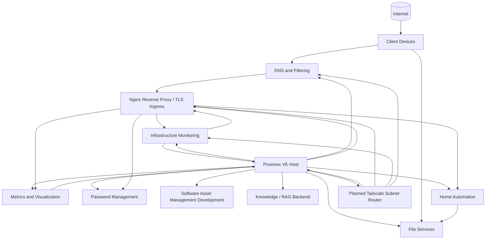

# Homelab Infrastructure

Sanitized documentation, automation, configuration examples, and operational records from my personal homelab environment.

This repository is a public portfolio of systems administration, infrastructure engineering, automation, observability, service operations, documentation, and systems design work. It deliberately excludes live credentials, exact location data, private endpoints, secrets, and other sensitive operational details.

## Start here

The following sections provide the main entry points into the homelab environment and its supporting documentation:

1. **Architecture:** [`architecture/overview.md`](architecture/overview.md) provides the sanitized system topology, workload roles, backup model, and design principles.
2. **Systems operations:** [`proxmox/README.md`](proxmox/README.md) explains the maintenance model and links to the hypervisor, guest, and full-environment maintenance procedures.
3. **Networking:** [`networking/README.md`](networking/README.md) documents DNS, split DNS, the dedicated Nginx reverse proxy, wildcard TLS, secure remote-access direction, dependencies, and troubleshooting.
4. **Monitoring:** [`monitoring/README.md`](monitoring/README.md) explains the Checkmk, Prometheus, Grafana, exporter, and alert-ownership model.
5. **Backup and recovery:** [`backup-recovery/README.md`](backup-recovery/README.md) documents the layered recovery model across snapshots, application backups, logical database dumps, and network backup copies.
6. **Security:** [`security/README.md`](security/README.md) describes exposure reduction, service accounts, secrets handling, backup resilience, and hardening priorities.
7. **Automation case study:** [`home-assistant/hvac/README.md`](home-assistant/hvac/README.md) documents a presence-aware HVAC control system built in Home Assistant.
8. **Change management:** [`change-management/README.md`](change-management/README.md) describes the lightweight change-control framework used throughout the lab.
9. **Detailed change examples:** [`change-management/examples/`](change-management/examples/) contains deeper records showing problem analysis, implementation, validation, rollback, and lessons learned.
10. **Wiki:** [Homelab Infrastructure Wiki](https://github.com/myles-portfolio/homelab-infrastructure/wiki) contains the canonical sanitized change log, roadmap, and operational notes.

## What this repository demonstrates

* Proxmox VE administration across virtual machines and Linux containers
* Hypervisor, guest, and full-environment maintenance orchestration
* Linux server and service maintenance
* Docker Compose application operations
* Checkmk infrastructure and service-state monitoring
* Prometheus metrics collection and Grafana visualization
* Notification delivery through Postfix and an authenticated SMTP relay
* PostgreSQL backup and validation
* Home Assistant automation and appliance maintenance
* Samba-based network storage and dedicated service accounts
* DNS, split DNS, centralized Nginx reverse proxy, and wildcard TLS architecture
* ACME DNS challenge validation without inbound HTTP exposure
* Planned Tailscale overlay networking for secure remote administration
* Service dependency mapping and layered network troubleshooting
* Workload-specific backup and rollback design
* SSH key-based administration and staged access hardening
* Security hardening and exposure reduction patterns
* Change management and maintenance documentation
* Validation of application health beyond package-manager success
* Public technical documentation with deliberate security sanitization

## Homelab architecture

The environment is centered on a Proxmox VE host that provides virtualization for the major infrastructure and application domains in the lab.

High-level view of the major functional domains hosted on the Proxmox platform. The remote-access node is a planned workload and is not yet deployed.

For a more detailed operational view, see [`architecture/overview.md`](architecture/overview.md).

## Current architecture direction

### Dedicated reverse proxy and wildcard TLS

A dedicated unprivileged Debian container hosts Nginx as the centralized ingress and TLS termination layer for selected internal web services.

The implementation uses a wildcard certificate issued through ACME DNS challenge validation. The private key is kept on the proxy rather than copied to every backend service, while DNS provider credentials remain outside source control.

The infrastructure monitoring web interface was the first production migration behind the proxy. Additional private web applications can continue to use this pattern where friendly HTTPS access is useful.

### Secure remote administration

Administrative remote access is being separated from application ingress.

Tailscale has been selected as the overlay VPN. The target design uses a dedicated lightweight Linux container as a subnet router so remote clients can reach private administrative services without publishing those interfaces through Nginx or opening inbound WAN ports.

Proxmox management is intentionally excluded from the reverse-proxy migration path. Remote administration will use Tailscale instead.

### Development and personal applications

The development VM hosts a Software Asset Management application backed by PostgreSQL. It is treated as a private user-facing application and will use the secure overlay network for remote reachability, with Nginx available for named HTTPS access.

The personal knowledge and RAG backend remains a private-first application platform built around PostgreSQL, pgvector, Markdown ingestion, and a future FastAPI query service.

### Media services

The previous Plex media-server container has been retired. Media hosting is deferred until dedicated storage, such as a NAS, is available and the storage architecture can be designed appropriately.

## Backup and recovery

The backup model uses multiple recovery layers so each failure can be addressed at the narrowest practical scope.

Examples include:

* short-lived Proxmox snapshots for fast VM rollback
* Home Assistant local and external network backups
* PostgreSQL logical dumps for database-level recovery
* Docker persistent storage for stateful application data
* dedicated Samba storage for backup copies outside protected workloads
* scheduled Proxmox guest backups for infrastructure workloads

The reverse-proxy container is now included in the core infrastructure backup policy. The personal knowledge and RAG backend is now included in the development backup policy. Backup creation and controlled restore validation remain distinct validation steps.

See [`backup-recovery/README.md`](backup-recovery/README.md) for the architecture and recovery decision model.

## Operating philosophy

A few principles recur throughout this environment:

1. Reconcile the live inventory before maintenance.
2. Put intentionally affected monitored hosts into scheduled downtime before disruptive maintenance.
3. Validate the hosted application, not only the operating system.
4. Use workload-appropriate recovery controls such as snapshots, application backups, and database dumps.
5. Use dedicated service accounts for machine-to-machine access when practical.
6. Remove temporary rollback artifacts after successful validation.
7. Treat application updates and guest operating-system updates as separate maintenance layers when appropriate.
8. Troubleshoot dependencies before restarting services or changing configuration.
9. Restore monitoring coverage only after post-maintenance validation is complete.
10. Reduce exposure and trust boundaries wherever practical.
11. Keep wildcard private keys and DNS provider credentials isolated from backend applications and source control.
12. Separate remote administrative access from application ingress.
13. Keep public documentation useful to reviewers without exposing the live environment unnecessarily.

## Current technology areas

| Area | Technologies and concepts |
|---|---|
| Virtualization | Proxmox VE, KVM, LXC, snapshots, QEMU Guest Agent, guest autostart |
| Linux operations | Ubuntu, Debian, package management, systemd, SSH, Ed25519 key authentication |
| Containers | Docker, Docker Compose, persistent volumes |
| Observability | Checkmk, Prometheus, Grafana, Node Exporter, PVE exporter, NUT exporter, active checks, scheduled downtime |
| Alert delivery | Checkmk notifications, Postfix, authenticated SMTP relay, TLS, contact-group routing |
| Data | PostgreSQL, pgvector, logical backups, query validation |
| Network services | Pi-hole, split DNS, Samba, Nginx reverse proxy, TLS termination, planned Tailscale subnet routing |
| PKI and certificates | ACME, DNS challenge validation, wildcard certificates, certificate lifecycle management |
| Backup and recovery | Proxmox guest backups, snapshots, Home Assistant backups, Samba backup copies, PostgreSQL dumps |
| Security | Service accounts, exposure reduction, SSH hardening, trusted proxies, overlay VPN design, secrets handling, recovery controls |
| Identity and secrets | Vaultwarden, dedicated service identities |
| Home automation | Home Assistant OS, HACS, Zigbee, climate automation |
| Operations | Change records, maintenance runbooks, full-environment playbooks, rollback planning, validation |

## Roadmap

The dedicated reverse-proxy isolation milestone is implemented and backup coverage is now assigned. Current follow-up work includes:

* deploy and validate the dedicated Tailscale subnet router
* automate wildcard certificate renewal and Nginx reload
* add certificate-expiration monitoring
* migrate additional private web applications through the proxy where appropriate
* validate backup creation and controlled restores for newer workloads
* continue broader SSH hardening
* improve independent backup resilience when additional hardware or a NAS becomes practical
* add further observability depth

See the [Wiki Roadmap](https://github.com/myles-portfolio/homelab-infrastructure/wiki/Roadmap) for the current priorities and planned work.

## Security and sanitization

The public repository is a curated documentation source, not a mirror of the live homelab configuration. Configuration examples are reviewed and sanitized before publication.

See [`security/README.md`](security/README.md) for the homelab security model and [`SECURITY.md`](SECURITY.md) for publication rules.
