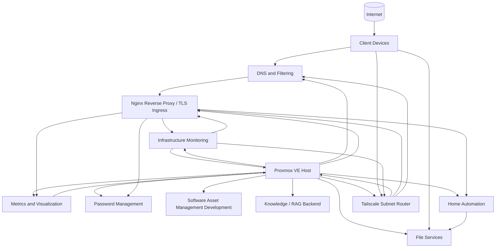

# Homelab Infrastructure

Sanitized documentation, automation, configuration examples, and operational records from my personal homelab environment.

This repository is a public portfolio of systems administration, infrastructure engineering, automation, observability, service operations, documentation, and systems design work. It deliberately excludes live credentials, exact location data, private endpoints, secrets, and other sensitive operational details.

## Start here

The following sections provide the main entry points into the homelab environment and its supporting documentation:

1. **Architecture:** [`architecture/overview.md`](architecture/overview.md) provides the sanitized system topology, workload roles, backup model, and design principles.
2. **Systems operations:** [`proxmox/README.md`](proxmox/README.md) explains the maintenance model and links to the hypervisor, guest, and full-environment maintenance procedures.
3. **Networking:** [`networking/README.md`](networking/README.md) documents DNS, split DNS, the dedicated Nginx reverse proxy, wildcard TLS, Tailscale secure remote access, dependencies, and troubleshooting.
4. **Monitoring:** [`monitoring/README.md`](monitoring/README.md) explains the Checkmk, Prometheus, Grafana, exporter, and alert-ownership model.
5. **Backup and recovery:** [`backup-recovery/README.md`](backup-recovery/README.md) documents the layered recovery model across snapshots, application backups, logical database dumps, and network backup copies.
6. **Security:** [`security/README.md`](security/README.md) describes exposure reduction, service accounts, secrets handling, backup resilience, and hardening priorities.
7. **Automation case study:** [`home-assistant/hvac/README.md`](home-assistant/hvac/README.md) documents a presence-aware HVAC control system built in Home Assistant.
8. **Change management:** [`change-management/README.md`](change-management/README.md) describes the lightweight change-control framework used throughout the lab.
9. **Detailed change examples:** [`change-management/examples/`](change-management/examples/) contains deeper records showing problem analysis, implementation, validation, rollback, and lessons learned.
10. **Wiki:** [Homelab Infrastructure Wiki](https://github.com/myles-portfolio/homelab-infrastructure/wiki) contains the canonical sanitized change log, roadmap, and operational notes.

## What this repository demonstrates

* Proxmox VE administration across virtual machines and Linux containers
* Hypervisor, guest, and full-environment maintenance orchestration
* Linux server and service maintenance
* Docker Compose application operations
* Checkmk infrastructure and service-state monitoring
* Prometheus metrics collection and Grafana visualization
* Notification delivery through Postfix and an authenticated SMTP relay
* PostgreSQL backup and validation
* Home Assistant automation and appliance maintenance
* Samba-based network storage and dedicated service accounts
* DNS, split DNS, centralized Nginx reverse proxy, and wildcard TLS architecture
* ACME DNS challenge validation without inbound HTTP exposure
* Tailscale overlay networking and subnet routing for secure remote administration
* deny-by-default remote access policy with explicit service reachability
* centralized private application ingress without direct application-host overlay membership where unnecessary
* service dependency mapping and layered network troubleshooting
* workload-specific backup and rollback design
* SSH key-based administration and staged access hardening
* security hardening and exposure reduction patterns
* change management and maintenance documentation
* validation of application health beyond package-manager success
* public technical documentation with deliberate security sanitization

## Homelab architecture

The environment is centered on a Proxmox VE host that provides virtualization for the major infrastructure and application domains in the lab.

High-level view of the major functional domains hosted on the Proxmox platform.

For a more detailed operational view, see [`architecture/overview.md`](architecture/overview.md).

## Current architecture direction

### Dedicated reverse proxy and wildcard TLS

A dedicated unprivileged Linux container hosts Nginx as the centralized ingress and TLS termination layer for selected internal web services.

The implementation uses a wildcard certificate issued through ACME DNS challenge validation. The private key is kept on the proxy rather than copied to every backend service, while DNS provider credentials remain outside source control.

The infrastructure monitoring web interface was the first production migration behind the proxy. The same pattern has since been validated for another private application, including native-client access over the secure overlay and split DNS.

Where an application-local TLS proxy no longer provides a distinct benefit, it can be removed after the centralized Nginx path is proven. This reduces duplicate certificate and proxy configuration on backend hosts.

### Secure remote administration

Administrative remote access is separated from application ingress.

Tailscale is deployed as the overlay VPN through a dedicated unprivileged Linux subnet-router container. Remote clients can reach approved private administrative services without publishing those interfaces through Nginx or opening inbound WAN ports.

The remote-access policy uses explicit Grants with deny-by-default behavior. Validation from an external network confirmed approved administrative and HTTPS paths while selected backend and non-approved paths remained unavailable.

Split DNS allows remote clients to use the same private service names as LAN clients. Private application hosts do not require direct Tailscale membership when remote access is already provided through the subnet router and reverse proxy.

The gateway is monitored through Checkmk and included in the appropriate scheduled backup policy.

Proxmox management is intentionally excluded from the reverse-proxy migration path. Remote administration uses Tailscale instead.

See [`networking/tailscale-remote-access.md`](networking/tailscale-remote-access.md).

### Development and personal applications

The development VM hosts a Software Asset Management application backed by PostgreSQL. It is treated as a private user-facing application and uses the secure overlay network for remote reachability, with Nginx available for named HTTPS access.

The personal knowledge and RAG backend remains a private-first application platform built around PostgreSQL, pgvector, Markdown ingestion, and a future FastAPI query service.

### Media services

The previous media-server container has been retired. Media hosting is deferred until dedicated storage is available and the storage architecture can be designed appropriately.

## Backup and recovery

The backup model uses multiple recovery layers so each failure can be addressed at the narrowest practical scope.

Examples include:

* short-lived hypervisor snapshots for fast rollback
* application-level backups where supported
* logical database dumps for database-level recovery
* persistent application storage for stateful containerized services
* additional network backup copies for selected workloads
* scheduled guest backups for infrastructure workloads

Backup creation and controlled restore validation remain distinct validation steps.

See [`backup-recovery/README.md`](backup-recovery/README.md) for the architecture and recovery decision model.

## Operating philosophy

A few principles recur throughout this environment:

1. Reconcile the live inventory before maintenance.
2. Put intentionally affected monitored hosts into scheduled downtime before disruptive maintenance.
3. Validate the hosted application, not only the operating system.
4. Use workload-appropriate recovery controls such as snapshots, application backups, and database dumps.
5. Use dedicated service accounts for machine-to-machine access when practical.
6. Remove temporary rollback artifacts after successful validation.
7. Treat application updates and guest operating-system updates as separate maintenance layers when appropriate.
8. Troubleshoot dependencies before restarting services or changing configuration.
9. Restore monitoring coverage only after post-maintenance validation is complete.
10. Reduce exposure and trust boundaries wherever practical.
11. Keep wildcard private keys and DNS provider credentials isolated from backend applications and source control.
12. Separate remote administrative access from application ingress.
13. Validate denied paths as well as permitted paths when testing access controls.
14. Remove duplicate infrastructure roles from application hosts when centralized services already provide the capability.
15. Keep public documentation useful to reviewers without exposing the live environment unnecessarily.

## Current technology areas

| Area | Technologies and concepts |
|---|---|
| Virtualization | Proxmox VE, KVM, LXC, snapshots, QEMU Guest Agent, guest autostart |
| Linux operations | Ubuntu, Debian, package management, systemd, SSH, Ed25519 key authentication |
| Containers | Docker, Docker Compose, persistent volumes |
| Observability | Checkmk, Prometheus, Grafana, Node Exporter, PVE exporter, NUT exporter, active checks, scheduled downtime |
| Alert delivery | Checkmk notifications, Postfix, authenticated SMTP relay, TLS, contact-group routing |
| Data | PostgreSQL, pgvector, logical backups, query validation |
| Network services | Pi-hole, split DNS, Samba, Nginx reverse proxy, TLS termination, Tailscale subnet routing |
| PKI and certificates | ACME, DNS challenge validation, wildcard certificates, certificate lifecycle management |
| Backup and recovery | guest backups, snapshots, application backups, network backup copies, logical database dumps |
| Security | Service accounts, exposure reduction, SSH hardening, trusted proxies, Tailscale Grants, secrets handling, recovery controls |
| Identity and secrets | Vaultwarden, dedicated service identities |
| Home automation | Home Assistant OS, HACS, Zigbee, climate automation |
| Operations | Change records, maintenance runbooks, full-environment playbooks, rollback planning, validation |

## Roadmap

The dedicated reverse-proxy isolation milestone and initial secure remote-access deployment are implemented. Current follow-up work includes:

* validate successful backup creation and controlled restore behavior for newer infrastructure workloads
* automate wildcard certificate renewal and Nginx reload
* add certificate-expiration monitoring
* migrate additional private web applications through the proxy where appropriate
* continue broader SSH hardening
* improve independent backup resilience when additional hardware becomes practical
* consider redundant subnet routing after independent always-on infrastructure is available
* add further observability depth

See the [Wiki Roadmap](https://github.com/myles-portfolio/homelab-infrastructure/wiki/Roadmap) for the current priorities and planned work.

## Security and sanitization

The public repository is a curated documentation source, not a mirror of the live homelab configuration. Configuration examples are reviewed and sanitized before publication.

See [`security/README.md`](security/README.md) for the homelab security model and [`SECURITY.md`](SECURITY.md) for publication rules.
