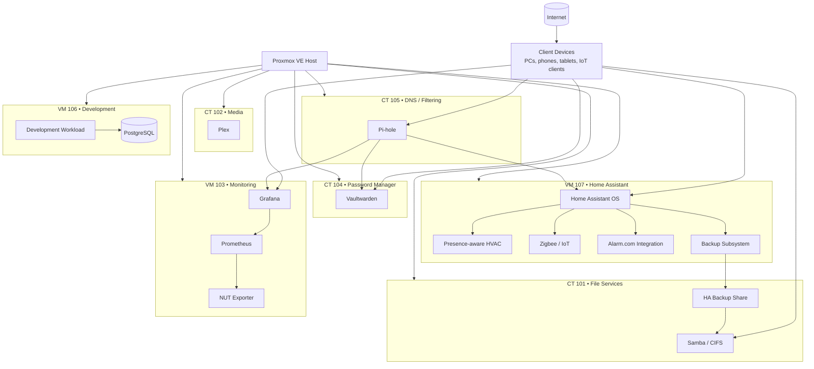

# Homelab Architecture Overview

## Purpose

This document provides a sanitized architectural view of the homelab represented in this repository. It is intentionally descriptive rather than exhaustive. Exact IP addressing, credentials, geofence boundaries, private DNS names, externally reachable endpoints, and other sensitive details are excluded.

## Operations-focused architecture

The diagram below shows the major Proxmox guests, primary application components, and selected dependency paths used for operations, maintenance, and troubleshooting.



Operations-focused view showing guest roles, major service components, and selected dependency paths.

### Legend

| Symbol / Label | Meaning |
|---|---|
| `CT` | Linux container |
| `VM` | Virtual machine |
| Cylinder shape | Persistent data store |
| Arrow | Primary dependency or service flow |
| Nested nodes | Applications or services hosted inside a guest |

The diagram is intentionally sanitized. Exact IP addresses, domains, ports, credentials, and other sensitive details are omitted.

## Core infrastructure domains

### Virtualization

Proxmox VE provides guest lifecycle management, snapshots, console access, storage management, and QEMU Guest Agent integration for supported virtual machines.

### File services

A dedicated Linux container provides Samba-based network storage. It is also used as an external backup target for selected services, including Home Assistant.

### Monitoring

A dedicated Ubuntu VM hosts a Docker Compose monitoring stack consisting of Prometheus, Grafana, and a NUT exporter. Monitoring application health is validated independently of operating-system package state.

### Identity and secrets

A dedicated container hosts a self-managed password manager. Application container updates are treated separately from guest operating-system maintenance.

### DNS and filtering

A dedicated container provides local DNS and filtering services. Service validation includes resolution tests rather than package status alone.

### Home automation

Home Assistant OS runs as a dedicated VM. It integrates local and cloud-connected devices, including Zigbee, environmental sensors, alarm-system entities, and climate control.

Home Assistant is treated as an appliance-style workload. Updates, backups, and application validation are performed through Home Assistant rather than generic Linux package management.

### Development workload

A dedicated Ubuntu VM hosts development tooling and PostgreSQL. Maintenance includes logical database backup, operating-system updates, database query validation, and QEMU Guest Agent checks.

## Operational design principles

The environment follows several recurring principles:

1. **Inventory before maintenance.** The current Proxmox guest inventory is reconciled before each maintenance cycle so newer workloads are not omitted from older checklists.
2. **Application validation matters.** A successful package upgrade is not considered sufficient evidence that the hosted service is healthy.
3. **Separate rollback layers.** VM snapshots, application backups, database dumps, and Home Assistant backups serve different recovery purposes.
4. **Prefer dedicated service accounts.** Machine-to-machine integrations use purpose-specific credentials where practical.
5. **Keep public documentation sanitized.** The portfolio documents architecture and reasoning without publishing a useful attack map of the live environment.
6. **Separate deterministic and dynamic automation.** Predictable routines are scheduled explicitly, while presence-aware automations handle deviations from the expected state.

## Example control path: HVAC

```text
Phone location
    |
    v
Home Assistant person entity
    |
    v
Neighborhood zone logic
    |
    +--> nearby / returned --> comfort target
    |
    +--> away for threshold --> away target
                                |
Weekly Scheduler ---------------+
                                v
                       Versatile Thermostat
                                |
                                v
                            Alarm.com
                                |
                                v
                       Physical thermostat
```

This design keeps the physical thermostat integration intact while moving routine scheduling and presence-aware control into Home Assistant.

## Backup model

Backup strategy is workload-specific:

* Home Assistant keeps local backups and writes a second copy to dedicated Samba network storage.
* PostgreSQL development data receives a logical database dump before higher-risk maintenance.
* Proxmox snapshots are used as temporary VM-level rollback protection when justified by the change.
* Application data stored in Docker volumes is validated before container recreation.

The intent is defense in depth rather than relying on a single recovery mechanism.
