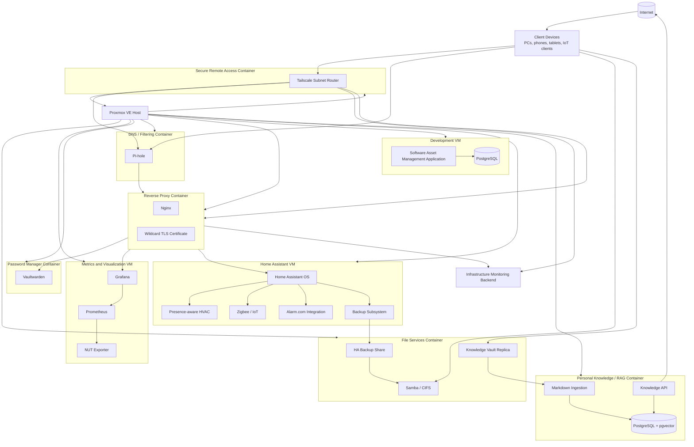

# Homelab Architecture Overview

## Purpose

This document provides a sanitized architectural view of the homelab represented in this repository. It is intentionally descriptive rather than exhaustive. Exact IP addressing, credentials, geofence boundaries, private DNS names, externally reachable endpoints, and other sensitive details are excluded.

## Operations-focused architecture

The diagram below shows the major Proxmox guests, primary application components, and selected dependency paths used for operations, maintenance, and troubleshooting.



Operations-focused view showing guest roles, major service components, and selected dependency paths.

### Legend

| Symbol / Label | Meaning |
|---|---|
| Linux container | Lightweight isolated service workload |
| Virtual machine | Full guest operating system workload |
| Cylinder shape | Persistent data store |
| Arrow | Primary dependency or service flow |
| Nested nodes | Applications or services hosted inside a guest |

The diagram is intentionally sanitized. Exact IP addresses, domains, ports, credentials, guest IDs, and other sensitive details are omitted.

## Core infrastructure domains

### Virtualization

Proxmox VE provides guest lifecycle management, snapshots, console access, storage management, and QEMU Guest Agent integration for supported virtual machines.

The Proxmox management interface is treated as private administrative infrastructure. Remote administration is provided through the secure Tailscale overlay rather than through the application reverse proxy.

### File services

A dedicated Linux container provides Samba-based network storage. It is also used as an external backup target for selected services, including Home Assistant. A separate ZFS-backed dataset is mounted into this container for a synchronized replica of the private Obsidian knowledge vault. The replica is treated as protected source data rather than as application state.

### Monitoring

A dedicated Ubuntu VM hosts a Docker Compose monitoring stack consisting of Prometheus, Grafana, and a NUT exporter. Monitoring application health is validated independently of operating-system package state.

Checkmk runs separately as the primary infrastructure and service-state monitoring platform. Its web interface was the first internal service migrated behind the dedicated reverse proxy.

### Identity and secrets

A dedicated container hosts a self-managed password manager. Application container updates are treated separately from guest operating-system maintenance.

### DNS and filtering

A dedicated container provides local DNS and filtering services. Service validation includes resolution tests rather than package status alone.

Local DNS also directs selected internal service names to the dedicated reverse proxy rather than directly to backend applications.

### Reverse proxy and TLS ingress

A dedicated unprivileged Linux container hosts Nginx as the centralized reverse proxy and TLS termination layer for selected internal web services.

The design uses a wildcard certificate issued through ACME DNS challenge validation. The certificate and its private key remain on the proxy rather than being distributed to every backend application. DNS provider credentials are stored outside source control.

Service migration is intentionally incremental. Monitoring was migrated first and validated end to end before additional internal web applications are moved behind the proxy. Administrative access to the Proxmox hypervisor is intentionally excluded from this migration path and uses the secure overlay network instead.

### Secure remote access

A dedicated unprivileged Debian Linux container provides Tailscale subnet routing for authenticated encrypted remote access.

The implementation separates responsibilities:

* Tailscale provides authenticated private network reachability.
* Nginx provides named HTTPS access and centralized TLS for selected private web applications.
* Administrative interfaces such as Proxmox and selected SSH targets remain private and are reached through Tailscale.
* Pi-hole administration is explicitly available over Tailscale while DNS service remains local infrastructure.
* Backend services such as PostgreSQL, Prometheus, exporters, and monitoring agents remain LAN-only where practical.

The gateway advertises the private IPv4 subnet and uses a deny-by-default Grant policy with explicit permitted paths. Positive and negative tests from an external network confirmed both intended reachability and intended denial behavior.

The gateway is monitored in Checkmk and included in the Core Infrastructure scheduled backup policy.

The subnet router shares the existing Proxmox host. A future second physical server or other independent infrastructure device could provide redundant remote access if higher availability becomes necessary.

See [`../networking/tailscale-remote-access.md`](../networking/tailscale-remote-access.md).

### Home automation

Home Assistant OS runs as a dedicated VM. It integrates local and cloud-connected devices, including Zigbee, environmental sensors, alarm-system entities, and climate control.

Home Assistant is treated as an appliance-style workload. Updates, backups, and application validation are performed through Home Assistant rather than generic Linux package management.

### Development workload

A dedicated Ubuntu VM hosts the development instance of a Software Asset Management application and PostgreSQL. Maintenance includes logical database backup, operating-system updates, database query validation, application validation, and QEMU Guest Agent checks.

The application is treated as a private user-facing service. The target access model keeps remote reachability on the secure overlay network while allowing Nginx to provide a friendly trusted HTTPS path.

### Personal knowledge and RAG platform

A dedicated Debian Linux container provides the backend runtime for a private-first personal knowledge system. The application architecture keeps the Obsidian Markdown vault authoritative while maintaining a rebuildable PostgreSQL and pgvector index for retrieval.

The current backend foundation includes PostgreSQL and pgvector. Planned application services include Markdown ingestion, semantic retrieval, and a FastAPI-based query service. Embedding and language-model inference use external APIs during the initial implementation so the homelab does not need local GPU inference capacity.

The synchronized vault replica and the derived RAG database are intentionally treated as separate recovery domains. The source Markdown should remain recoverable independently of the vector index.

### Deferred media services

The previous media-server workload has been retired from the active guest inventory. Media hosting is deferred until dedicated storage, such as a NAS, is available and the storage architecture can be designed around the workload rather than added incrementally to the current host.

## Operational design principles

The environment follows several recurring principles:

1. **Inventory before maintenance.** The current Proxmox guest inventory is reconciled before each maintenance cycle so newer workloads are not omitted from older checklists.
2. **Application validation matters.** A successful package upgrade is not considered sufficient evidence that the hosted service is healthy.
3. **Separate rollback layers.** VM snapshots, application backups, database dumps, and Home Assistant backups serve different recovery purposes.
4. **Prefer dedicated service accounts.** Machine-to-machine integrations use purpose-specific credentials where practical.
5. **Keep public documentation sanitized.** The portfolio documents architecture and reasoning without publishing a useful attack map of the live environment.
6. **Separate deterministic and dynamic automation.** Predictable routines are scheduled explicitly, while presence-aware automations handle deviations from the expected state.
7. **Keep source data independent of derived indexes.** Search indexes, embeddings, and other derived data should be reproducible from protected source material rather than becoming the only copy of important information.
8. **Centralize ingress deliberately.** Reverse proxy and certificate lifecycle responsibilities are isolated from backend applications so service identity, TLS, and routing can evolve independently.
9. **Separate remote access from application ingress.** Secure administrative reachability and HTTPS application presentation are different responsibilities and should not be coupled unnecessarily.
10. **Validate denied paths.** Security controls are not considered proven only because intended access succeeds; restricted paths should also be tested.

## Example control path: HVAC

```text
Phone location
    |
    v
Home Assistant person entity
    |
    v
Neighborhood zone logic
    |
    +--> nearby / returned --> comfort target
    |
    +--> away for threshold --> away target
                                |
Weekly Scheduler ---------------+
                                v
                       Versatile Thermostat
                                |
                                v
                            Alarm.com
                                |
                                v
                       Physical thermostat
```

This design keeps the physical thermostat integration intact while moving routine scheduling and presence-aware control into Home Assistant.

## Backup model

Backup strategy is workload-specific:

* Home Assistant keeps local backups and writes a second copy to dedicated Samba network storage.
* PostgreSQL development data receives a logical database dump before higher-risk maintenance.
* The private knowledge vault is synchronized to dedicated ZFS-backed homelab storage with file versioning enabled on the receiving side.
* The RAG backend container is included in the development scheduled guest backup policy. Backup creation and controlled restore validation remain separate validation steps.
* The reverse-proxy container is included in the core infrastructure scheduled guest backup policy. Backup creation and controlled restore validation remain separate validation steps.
* The remote-access gateway is included in the core infrastructure scheduled guest backup policy. Restore testing must account for duplicate network or Tailscale identity risk.
* Proxmox snapshots are used as temporary VM-level rollback protection when justified by the change.
* Application data stored in Docker volumes is validated before container recreation.

The intent is defense in depth rather than relying on a single recovery mechanism.
