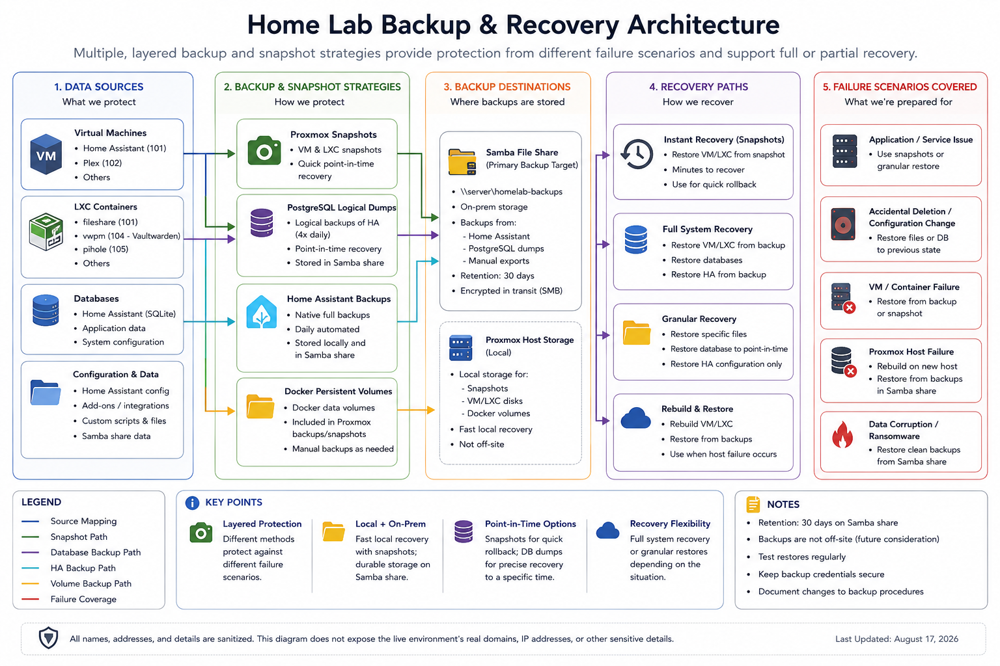

# Backup and Recovery

## Overview

This section documents the layered backup and recovery model used across the homelab.

The environment does not rely on a single recovery mechanism. Different workloads use different controls because scheduled guest backups, snapshots, application backups, logical database dumps, persistent volumes, and network backup copies protect against different failure modes.

## Backup and recovery architecture

The following diagram summarizes the major recovery layers and their intended use.



The diagram is intentionally sanitized and does not expose the live environment's real domains, IP addresses, credentials, or storage paths.

## Recovery layers

### Scheduled Proxmox guest backups

Proxmox VE provides scheduled VM and container backups to dedicated backup storage on the mirrored ZFS pool.

Backup jobs are organized by workload rather than using a single all-guests job. This isolates failures, allows different backup modes where needed, and makes retention and recovery requirements easier to manage as services evolve.

Current job groupings include:

* core infrastructure services
* monitoring
* Home Assistant
* file services
* development workloads

New infrastructure workloads are not considered fully operational until their backup scope is reviewed and added to the appropriate scheduled job.

The reverse-proxy container is now included in the core infrastructure backup policy. The personal knowledge and RAG backend is now included in the development backup policy. In both cases, successful scheduled backup creation and controlled restore validation remain separate validation requirements.

Snapshot mode is used where it works reliably. The file-services container uses Stop mode because repeated Snapshot-mode attempts stalled during snapshot creation, while Stop mode completed successfully and returned the service to normal operation.

ZSTD compression is used for scheduled guest backups. Retention preserves recent, daily, weekly, and monthly recovery points rather than only the newest copy.

A successful backup task confirms that Proxmox created the expected backup artifact. It does not, by itself, prove that the guest can be recovered successfully. Recoverability is validated separately through controlled restore testing.

Typical use:

* recover a VM or container after guest-level failure or loss
* restore a known recovery point without depending on an existing guest disk
* validate infrastructure recovery procedures through an isolated test restore

### Proxmox snapshots

Temporary Proxmox snapshots provide fast VM-level rollback during selected maintenance windows.

They are useful when a change may affect the guest operating system or the VM as a whole, but they are not treated as long-term backups.

Typical use:

* take snapshot before higher-risk maintenance
* apply operating-system or application changes
* validate the workload
* remove the snapshot after successful validation

Snapshots are intentionally short-lived to avoid unnecessary storage consumption and dependence on stale rollback points.

### Home Assistant backups

Home Assistant uses its application-level backup system for configuration and appliance recovery.

The current design stores backup copies in two locations:

* local Home Assistant storage
* external Samba network storage hosted outside the Home Assistant VM

This provides a recovery path even if the Home Assistant VM itself is damaged or unavailable.

The backup workflow includes automatic backups, backup creation before updates, retention controls, and manual validation of both storage targets.

### PostgreSQL logical backups

The Development VM uses PostgreSQL logical dumps before higher-risk maintenance.

A logical dump protects the application database independently of the VM and provides a more granular recovery option than reverting the entire guest.

This is useful when the operating system remains healthy but database data or schema changes need to be restored.

### Docker persistent data

Stateful containerized applications depend on persistent volumes or bind-mounted application data.

Container recreation is therefore treated separately from data removal. Refreshing an image and recreating a Compose service should not delete persistent application data unless a recovery procedure explicitly requires it.

For workloads such as Vaultwarden, the running container is replaceable while the persistent application state is the critical recovery asset.

### Reverse-proxy configuration and certificate state

The dedicated reverse proxy is a core infrastructure workload because several internal web services can depend on its routing and TLS configuration.

Its recovery scope includes:

* Nginx site configuration
* ACME client configuration
* issued certificate state
* renewal configuration and deploy hooks once implemented
* SSH and operating-system hardening required to administer the workload

The DNS provider API credential and private key material are not stored in the public repository. Recovery documentation should preserve the process for re-establishing those secrets without embedding them in source control.

The guest is now covered by the core infrastructure scheduled backup policy. A documented DNS rollback path remains useful because it provides service continuity if the reverse proxy fails even when a recoverable backup exists.

### Network storage

The file-services container provides external storage for selected application backups.

A dedicated Samba share and service account are used for the Home Assistant backup path so machine-to-machine access is scoped to the required resource rather than a general-purpose user account.

## Backup storage design

The local Proxmox backup dataset resides on the same mirrored ZFS pool that hosts primary guest storage.

This design provides useful protection against guest loss, bad updates, accidental deletion within a guest, and a single physical disk failure because the ZFS mirror preserves pool availability after one mirror member fails.

It does not provide an independent recovery copy against complete pool loss, host loss, or a failure that affects both the primary guest storage and local backup dataset.

An independent backup destination, such as separate external storage, another host, a NAS, or Proxmox Backup Server, remains a future resilience improvement when practical.

## Backup scope limitations

Guest-level backup coverage does not automatically include every dataset visible from inside a VM or container.

Proxmox-managed guest volumes are included according to the backup configuration, while externally mounted storage, bind mounts, and other non-volume paths may be excluded. For example, a bind-mounted dataset attached to the file-services container is excluded from the container backup because it is not a Proxmox-managed guest volume.

Backup review therefore includes both of the following questions:

1. Is the guest itself covered by a scheduled backup?
2. Are any externally mounted or bind-mounted datasets protected through a separate recovery mechanism?

A successful guest backup must not be interpreted as proof that every accessible dataset is protected.

## Why multiple recovery methods exist

The recovery methods are complementary rather than interchangeable.

| Recovery control | Best suited for | Example failure |
|---|---|---|
| Scheduled Proxmox backup | Full guest recovery | VM or container is lost, corrupted, or must be rebuilt from backup |
| Proxmox snapshot | Fast guest-level rollback | VM maintenance introduces a boot or configuration failure |
| Home Assistant backup | Application or appliance restore | Home Assistant configuration becomes unusable |
| PostgreSQL logical dump | Database-level recovery | Database data or schema needs restoration |
| Docker persistent data | Application state preservation | Container image is recreated or replaced |
| External Samba backup | Recovery outside the source VM | Home Assistant VM or local backup storage fails |

## Validation model

A backup is not considered trustworthy simply because a job reports success.

Validation is performed in two stages.

### Backup creation validation

Confirm that:

* the scheduled job completes successfully
* the expected guest appears in the backup log
* the backup artifact exists on the intended backup storage
* retention settings are applied as expected
* known exclusions such as bind mounts are understood and documented

### Restore validation

A controlled restore test provides stronger evidence of recoverability.

The preferred guest restore test is:

1. restore a recent backup as a temporary VM or container with a different guest ID
2. keep the restored guest isolated from the production network when duplicate addresses, hostnames, or service identities could conflict
3. boot the restored guest
4. validate operating-system startup and expected application data
5. validate the primary service or application using local console access where practical
6. shut down and remove the temporary restored guest after validation

This process has been successfully exercised with the Checkmk monitoring VM. A fresh backup was restored to a temporary isolated VM with networking disconnected, then validated for operating-system startup, Checkmk installation, monitoring site presence, site data, and site service state. The temporary restored VM was removed after validation.

For a monitoring server, validation should include the operating system, installed monitoring software, site or application configuration, and service state rather than merely proving that the guest reaches a login prompt.

A backup job ending successfully proves backup creation. A successful controlled restore and application validation provide evidence that the backup is actually recoverable.

Other recovery-layer validation examples include:

* Home Assistant backup appears in both local and external locations
* PostgreSQL dump file exists and the application database remains queryable after maintenance
* Proxmox snapshot is visible before the change and intentionally removed afterward
* Docker services return with persistent application state intact after recreation
* Samba backup destination accepts an authenticated write
* reverse-proxy configuration and certificate state are present after a controlled guest restore

## Recovery decision model

Use the narrowest recovery mechanism that safely addresses the failure.

```text
Failure detected
      |
      v
Is the issue application data only?
      |
      +--> yes --> application backup or database restore
      |
      +--> no
             |
             v
Is the guest operating system or VM state affected?
             |
             +--> yes --> snapshot rollback or full guest recovery
             |
             +--> no --> service-level remediation
```

Restoring an entire VM when only a database needs recovery creates unnecessary impact. Conversely, restoring application data alone will not fix a broken guest operating system.

## Operational principles

1. **Choose recovery controls by workload.** Different applications require different recovery mechanisms.
2. **Keep at least one recovery copy outside the protected workload when practical.**
3. **Do not confuse snapshots with backups.** Snapshots are primarily short-term rollback tools.
4. **Validate recoverability, not only backup creation.** A successful backup task is necessary evidence, but a controlled restore test provides stronger proof.
5. **Understand backup scope.** Guest backups may exclude bind mounts, external datasets, and other storage outside Proxmox-managed guest volumes.
6. **Isolate backup failures.** Workload-specific jobs prevent one unusual guest from blocking unrelated backups.
7. **Remove temporary rollback and restore-test artifacts after validation.**
8. **Preserve persistent application data when recreating containers.**
9. **Use the least disruptive recovery method that solves the problem.**
10. **Review backup coverage whenever a new infrastructure guest is deployed.**

## Current improvement areas

Workload-specific scheduled Proxmox backup coverage is in place for the established guest inventory, including the reverse proxy and personal knowledge backend. The restore workflow has been validated successfully with a critical monitoring VM.

Additional planned work includes:

* validate successful scheduled backup creation for newly added workloads
* periodically repeat guest restore tests for critical workloads
* identify external or bind-mounted datasets requiring separate backup coverage
* add Checkmk-native site backups as an application-level recovery layer alongside VM-level protection
* define restore-test frequency for critical workloads
* add an independent backup destination when hardware or budget permits

See the project wiki roadmap for the broader infrastructure backlog.
