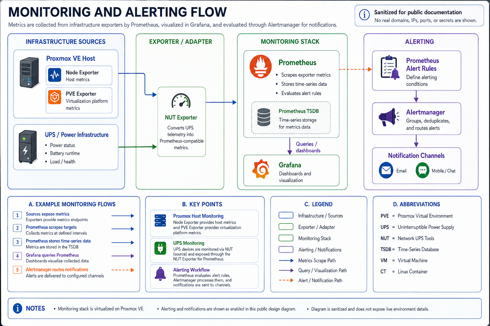

# Monitoring and Observability

## Overview

This section documents the sanitized monitoring architecture used by the homelab.

The current metrics stack is hosted on a dedicated Ubuntu virtual machine and uses Docker Compose to run Prometheus, Grafana, and a NUT exporter. Prometheus also scrapes host-level metrics from the Proxmox VE host through Node Exporter and a Proxmox-specific exporter. Alertmanager and Prometheus alert rules are the next implementation step for metrics-based alerting.

Checkmk Raw Edition is also planned as a complementary infrastructure and service-monitoring layer. It is not intended to replace Prometheus or Grafana. The planned role for Checkmk is host state, service state, Linux agent monitoring, SNMP monitoring, and other operational checks where an infrastructure-oriented monitoring model is more useful than time-series analysis.

See [`checkmk-plan.md`](checkmk-plan.md) for the deployment and evaluation plan.

## Monitoring and alerting architecture

The existing diagram shows the sanitized metric flow from infrastructure and UPS metric sources through exporters into Prometheus, then into Grafana for visualization and Alertmanager for notification routing.



The diagram is intentionally sanitized and does not expose the live environment's real domains, IP addresses, ports, credentials, or other sensitive details. The Alertmanager portion represents the near-term Prometheus target state.

The longer-term monitoring model introduces Checkmk alongside this stack rather than in front of or behind Prometheus:

```text
Infrastructure
   |
   +--> Checkmk agents / SNMP / active checks
   |          |
   |          v
   |       Checkmk
   |
   +--> exporters
              |
              v
          Prometheus
              |
              +--> Grafana
              |
              +--> Alertmanager
```

This separation allows each platform to focus on the monitoring model it handles best while avoiding unnecessary coupling.

## Current metric collection path

The validated collection path currently includes:

```text
Proxmox VE Host
   |          |
   v          v
Node       PVE
Exporter   Exporter
   \          /
    \        /
     v      v
    Prometheus
        |
        v
      Grafana

UPS / NUT source
       |
       v
  NUT Exporter
       |
       v
   Prometheus
```

This distinction matters because Grafana is the visualization layer, while Prometheus is the collection and time-series storage layer.

## Components

### Prometheus

Prometheus collects metrics from configured targets and exposes target health, query results, and scrape status.

The current validated scrape targets include:

* Node Exporter on the Proxmox host for host operating-system metrics
* Proxmox/PVE exporter for virtualization platform metrics
* NUT exporter for UPS and power telemetry

Operational validation includes:

* Prometheus HTTP response
* active target status
* individual exporter health
* successful query execution when needed

Prometheus also stores the collected time-series data locally.

### Grafana

Grafana provides dashboards and visualization over the metrics collected by Prometheus.

A healthy Grafana container does not prove that Prometheus or its targets are healthy, so dashboard availability and data-source health are treated as separate checks.

### Node Exporter

Node Exporter runs on the Proxmox host and exposes host-level system metrics to Prometheus.

This provides visibility into the underlying Linux host independently of the virtualization-specific metrics exposed by the PVE exporter.

### Proxmox/PVE exporter

The PVE exporter exposes Proxmox-specific metrics to Prometheus, providing visibility into the virtualization platform beyond generic host operating-system metrics.

### NUT exporter

The NUT exporter translates Network UPS Tools data into Prometheus-compatible metrics.

Because the exporter port is not published to the Monitoring VM host, validation is performed through Prometheus target health rather than assuming direct localhost access should work.

### Alertmanager

Alertmanager is the planned notification-routing layer for Prometheus alerts.

The intended flow is:

```text
Prometheus alert rule
        |
        v
    Alertmanager
        |
        v
Notification channel
```

Alertmanager will handle grouping, deduplication, silencing, and routing after alert rules are implemented.

### Checkmk

Checkmk Raw Edition is planned for deployment on a dedicated Debian virtual machine.

Its intended responsibilities include:

* host and service state monitoring
* Linux agent-based monitoring
* SNMP monitoring for supported infrastructure
* active service availability checks
* infrastructure-focused notifications where appropriate

Checkmk notification coverage will be introduced carefully because the existing Prometheus roadmap already includes Alertmanager. One authoritative notification path should be selected for each operational condition to avoid duplicate alerts.

## Monitoring VMs

The existing Prometheus and Grafana stack runs on a dedicated Ubuntu VM rather than directly on the Proxmox host.

This provides:

* workload isolation
* independent operating-system maintenance
* application-level container management
* a clear rollback boundary
* easier separation between monitoring platform health and hypervisor health

See [`../proxmox/runbooks/monitoring-vm-maintenance.md`](../proxmox/runbooks/monitoring-vm-maintenance.md) for the verified maintenance workflow.

The planned Checkmk deployment will use a separate Debian VM so Checkmk can be maintained, backed up, tested, and retired independently of the Prometheus stack.

## Validation model

The current Prometheus stack is validated in layers:

1. confirm the VM is healthy
2. confirm Docker is healthy
3. confirm the monitoring containers are running
4. confirm Prometheus responds
5. confirm Grafana responds
6. confirm critical Prometheus targets report healthy
7. confirm dashboards show expected data where applicable
8. after alerting is implemented, confirm test alerts reach Alertmanager and the configured notification channel

This prevents a false positive where the monitoring UI is online but the underlying collection or notification path is broken.

Checkmk will use a similar layered validation model covering VM health, site health, agent connectivity, service discovery, monitored service state, and notification delivery.

## Maintenance model

Application images and guest operating-system packages are treated as separate maintenance layers for the existing containerized monitoring stack.

Typical sequence:

```text
Baseline validation
    |
    v
Guest OS package maintenance
    |
    v
System health validation
    |
    v
Container image refresh
    |
    v
Compose recreation
    |
    v
Target and UI validation
```

Rollback protection is selected before the change based on risk and available storage.

Checkmk will have its own maintenance workflow because it is planned as a native application installation on a dedicated Debian VM rather than part of the existing Docker Compose stack.

## Observability principles

1. **Monitor dependencies, not just hosts.** A running VM does not prove the hosted service is functional.
2. **Validate collection paths.** Prometheus target state is evidence that data is actually being scraped.
3. **Keep visualization separate from collection.** Grafana and Prometheus have different failure modes.
4. **Use exporters deliberately.** Exporters extend visibility into systems that do not expose Prometheus-native metrics.
5. **Use infrastructure checks deliberately.** Checkmk should add operational state visibility rather than duplicate every Prometheus metric.
6. **Treat monitoring as production-like infrastructure.** The monitoring systems themselves require updates, backups, validation, and rollback planning.
7. **Alert on actionable conditions.** Alert rules and service checks should identify conditions that require attention rather than every metric fluctuation.
8. **Avoid duplicate notifications.** A condition monitored by multiple platforms should normally have one authoritative notification path.
9. **Validate notification delivery.** A firing rule or critical service state is not enough if the notification path is broken.

## Current monitoring coverage

The validated stack currently includes Proxmox host metrics, Proxmox virtualization metrics, and UPS-related monitoring through Prometheus and Grafana. Alertmanager, notification routing, and Prometheus alert-rule implementation remain planned improvements.

Checkmk is currently a planned addition and has not yet been deployed. Its evaluation and rollout sequence are documented in [`checkmk-plan.md`](checkmk-plan.md).

See [`alerting-roadmap.md`](alerting-roadmap.md) for the existing Prometheus alerting implementation backlog.
