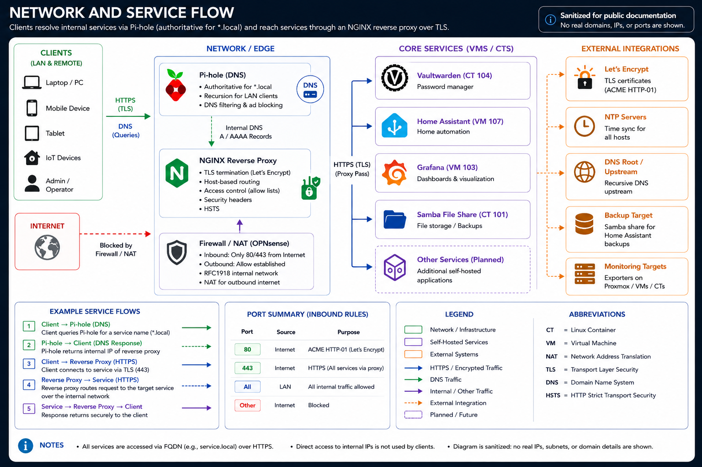

# Networking

## Overview

This section documents the sanitized networking patterns used by the homelab.

The goal is to show how local name resolution, service access, reverse-proxy behavior, secure remote access, and internal dependencies are structured without publishing a complete live network map.

## Current design

The environment uses a private home LAN with Proxmox-hosted services and Home Assistant integrations distributed across virtual machines and Linux containers.

Key networking functions include:

- local DNS and filtering through Pi-hole
- split DNS for internal service names
- a dedicated Nginx reverse proxy for centralized HTTPS termination and hostname-based routing
- wildcard TLS for selected internal service names
- Samba/CIFS for network storage
- local-only service communication where practical
- trusted-proxy handling in Home Assistant
- no requirement for direct inbound WAN port forwarding for internally hosted web services documented here
- Tailscale overlay networking through a dedicated subnet-router container for authenticated encrypted remote access

## Logical flow

```text
Local client
    |
    v
Local DNS resolver
    |
    +--> internal service name --> reverse proxy
    |                                 |
    |                                 v
    |                            backend service
    |
    +--> public domain lookup --> upstream DNS
```

Remote administrative access follows a separate path:

```text
Trusted remote device
       |
       v
    Tailscale
       |
       v
Dedicated subnet router
       |
       v
Private homelab LAN
```

Selected private web applications combine both patterns. Tailscale controls remote network reachability, split DNS provides the internal service name, and Nginx provides the named HTTPS application path.

## Network and service flow

The current network diagram documents the local DNS and reverse-proxy relationships. The remote-access path is documented separately in [`tailscale-remote-access.md`](tailscale-remote-access.md).



The diagram is intentionally sanitized and does not expose the live environment's real domains, IP addresses, or other sensitive addressing details.

## Design principles

1. **Name services by function rather than port number.** Clients should access services through stable names where practical.
2. **Keep backend services private.** The reverse proxy provides the user-facing HTTPS path while backend ports remain internal.
3. **Use split DNS deliberately.** Internal clients can resolve a service name to the proxy path without requiring hairpin WAN routing.
4. **Centralize TLS without distributing private keys broadly.** The wildcard certificate remains on the dedicated proxy rather than being copied to every backend.
5. **Avoid unnecessary WAN exposure.** Certificate automation and remote access should not require opening inbound ports when safer alternatives exist.
6. **Separate administrative access from application ingress.** Tailscale provides private remote reachability, while Nginx provides HTTPS application presentation where appropriate.
7. **Keep backend-only services local.** Databases, monitoring collectors, exporters, and agents should not gain remote exposure without an explicit requirement.
8. **Validate DNS separately from application health.** A service can be running while name resolution is broken, and the reverse can also be true.
9. **Document dependencies.** DNS, remote access, reverse proxy, authentication, certificate state, and backend services are separate failure domains.

## Key components

### Pi-hole

Pi-hole provides local DNS filtering and selected local DNS overrides. It is also a critical dependency for service names that rely on split DNS.

Selected internal service names resolve to the dedicated reverse proxy rather than directly to application backends.

For remote clients, Tailscale split-DNS configuration forwards the homelab namespace to the internal resolver so the same private service names work outside the LAN. DNS access is explicitly permitted through the overlay without exposing the DNS service to the WAN.

Pi-hole's administrative interface is separately reachable through an explicitly granted Tailscale path.

See [`dns-and-split-dns.md`](dns-and-split-dns.md).

### Reverse proxy

A dedicated unprivileged Linux container hosts Nginx as the centralized ingress and TLS termination layer for selected internal services.

The proxy uses a wildcard certificate issued through ACME DNS challenge validation. Service migrations are staged rather than moved all at once. Monitoring was used as the first production validation target, followed by additional private applications after the access model had been validated.

One application migration also removed an application-local TLS proxy after Nginx was proven as the sole client-facing HTTPS layer. This reduced duplicate proxying and certificate lifecycle responsibilities on the backend host.

The reverse proxy is not the remote-administration gateway. Proxmox and SSH are intentionally excluded from the reverse-proxy publication model and use the overlay network for remote access.

See [`reverse-proxy-pattern.md`](reverse-proxy-pattern.md).

### Tailscale subnet router

A dedicated unprivileged Linux container provides Tailscale subnet routing for secure remote access.

The gateway advertises the required private network route to authenticated Tailscale clients while remaining separate from the hypervisor, reverse proxy, DNS service, monitoring platform, and application workloads.

The node acts as a subnet router, not as an exit node. Access is controlled with explicit Grants rather than unrestricted reachability across the advertised network.

A future independent always-on device could provide redundant subnet routing if higher availability becomes necessary.

See [`tailscale-remote-access.md`](tailscale-remote-access.md).

### Home Assistant trusted proxy

Home Assistant is configured to trust only the expected reverse-proxy sources when processing forwarded client information. Public documentation preserves the concept but omits the real address ranges.

## Access classes

Services are classified by access requirement rather than by implementation technology.

| Access class | Typical services | Intended path |
|---|---|---|
| Private administrative | Proxmox, SSH, development administration | Tailscale |
| Private user-facing web | Monitoring, password management, Home Assistant, development applications, personal knowledge services | Tailscale plus Nginx where named HTTPS is useful |
| Local administrative web | DNS administration | LAN plus explicitly granted Tailscale access |
| Backend infrastructure | PostgreSQL, Prometheus, exporters, monitoring agents | LAN only unless a specific remote requirement is documented |
| Local data services | Samba and similar storage services | LAN by default, optional Tailscale access when justified |

The Tailscale policy uses explicit Grants and a deny-by-default model rather than an unrestricted allow-all rule.

## Dependency examples

### Monitoring web access

```text
Client
  |
  v
Private network reachability
  |
  v
Split DNS
  |
  v
Nginx reverse proxy
  |
  v
Monitoring backend
```

If DNS fails, the backend may remain healthy while the service name stops resolving.

If the reverse proxy fails, DNS may resolve correctly while HTTPS access fails.

If the backend fails, DNS and TLS may still appear healthy even though the application is unavailable.

For remote clients, failure of the Tailscale path is an additional independent failure domain.

### Password-management access

```text
Remote or local client
        |
        v
Private network reachability
        |
        v
Split DNS
        |
        v
Nginx reverse proxy
        |
        v
Password-management backend
```

The application host does not need direct Tailscale membership when remote clients can reach it through the subnet router and reverse proxy. Native mobile access was validated over an external network after split DNS and the centralized HTTPS path were in place.

### Home Assistant reverse-proxy access

```text
Client
  |
  v
Reverse proxy
  |
  v
Home Assistant
      |
      +--> validates trusted proxy source
      +--> accepts forwarded client information
```

## Operational validation

Networking changes should be validated at more than one layer:

1. confirm expected DNS resolution
2. confirm TCP connectivity to the service path
3. confirm TLS behavior where HTTPS is used
4. confirm the reverse proxy selects the intended backend
5. confirm the backend application responds
6. confirm authentication and normal user workflows still function
7. confirm monitoring checks reflect the new ingress path
8. for remote-access changes, confirm the intended Tailscale route is available and unauthorized paths remain unavailable
9. for native applications, test an actual client from an external network rather than relying only on browser or TCP tests

The Tailscale deployment was validated from an external client network rather than from the home LAN. Positive tests confirmed access to intended administrative and HTTPS paths. Negative tests confirmed that selected LAN-only and non-approved paths remained unavailable through the overlay.

Before a DNS cutover, a client can force a single request to the new proxy address while preserving the production hostname. This validates certificate trust and proxy routing without changing normal resolution for other clients.

After DNS changes, direct resolver tests should confirm that stale host-level or duplicate local records are not returning an obsolete backend address alongside the proxy address.

## Security and sanitization

The public repository intentionally excludes:

- exact private IP assignments
- public service domains tied to the live environment
- router management details
- API credentials
- certificate-provider tokens
- wildcard private keys
- firewall-rule inventories
- exact trusted-proxy subnets
- Tailscale device addresses, tailnet names, authentication keys, and detailed live Grant policy
- exact application backend listeners and live split-DNS records

The architecture remains useful as a portfolio artifact without exposing a detailed attack map.
